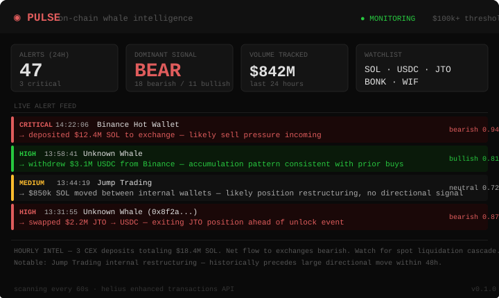
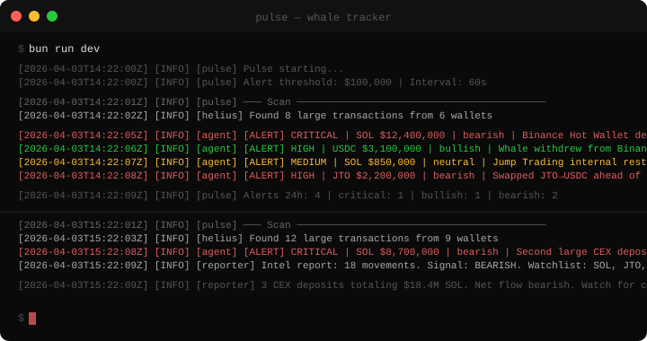

<div align="center">

# Pulse

**On-chain whale intelligence for Solana.**
Watches every large transaction in real-time. Asks Claude what it means. Tells you whether to follow or fade.

[](https://github.com/PulseSolana/PulseSolana/actions)

[](https://docs.anthropic.com/en/docs/agents-and-tools/claude-agent-sdk)
[](https://www.typescriptlang.org/)

</div>

---

Whale alerts without context are noise. A $10M SOL transfer could be a sell, a restake, or an internal wallet shuffle — and they require completely different responses.

`Pulse` fetches large on-chain transactions via Helius, matches wallets against known labels (exchanges, market makers, funds), and feeds everything to a Claude agent that reasons about intent. Was that a CEX deposit or a cold wallet sweep? Is the cluster accumulating or distributing? The answer comes with a confidence score and a one-line signal you can act on.

```
DETECT → LABEL → REASON → SIGNAL → REPORT
```

---

## Live Dashboard



---

## Terminal Output



---

## Architecture

```
┌──────────────────────────────────────────────────────┐
│                  Helius Watcher                       │
│   Enhanced TX API · $100k+ filter · Label lookup     │
└──────────────────────┬───────────────────────────────┘
                       ▼
┌──────────────────────────────────────────────────────┐
│               Classifier                              │
│   Severity bucketing · Dedup · Wallet grouping       │
└──────────────────────┬───────────────────────────────┘
                       ▼
┌──────────────────────────────────────────────────────┐
│            Claude Agent Loop                          │
│   get_recent_movements → get_wallet_profile          │
│   → get_token_context → submit_alert                 │
└──────────────────────┬───────────────────────────────┘
                       ▼
┌──────────────────────────────────────────────────────┐
│               Reporter                                │
│   Alert ingestion · 24h rolling window              │
│   Hourly intel report · Watchlist generation        │
└──────────────────────────────────────────────────────┘
```

---

## Alert Severity

| Level | Threshold | Example |
|-------|-----------|---------|
| **Critical** | $5M+ | Exchange deposit, fund rebalance |
| **High** | $1M–$5M | Large swap, whale accumulation |
| **Medium** | $100k–$1M | Notable movement, watch closely |

---

## Signal Interpretation

The Claude agent classifies each movement:

| Pattern | Signal | Reasoning |
|---------|--------|-----------|
| CEX deposit (large) | Bearish | Intent to sell |
| CEX withdrawal (large) | Bullish | Accumulation |
| Whale → cold wallet | Bullish | Long-term hold |
| Whale → DEX swap out | Bearish | Exiting position |
| Internal transfer | Neutral | No directional signal |
| Staking | Bullish | Long-term conviction |
| Unstaking | Watch | Potential sell incoming |

---

## Quick Start

```bash
git clone https://github.com/PulseSolana/PulseSolana
cd PulseSolana && bun install
cp .env.example .env
bun run dev
```

---

## Configuration

```bash
ANTHROPIC_API_KEY=sk-ant-...
HELIUS_API_KEY=...
ALERT_THRESHOLD_USD=100000
HIGH_ALERT_THRESHOLD_USD=1000000
CRITICAL_ALERT_THRESHOLD_USD=5000000
SCAN_INTERVAL_MS=60000
```

---

## License

MIT

---

*follow the money. read the chain.*
